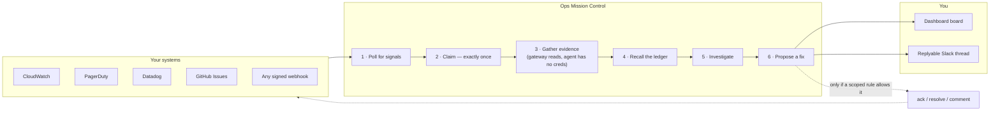
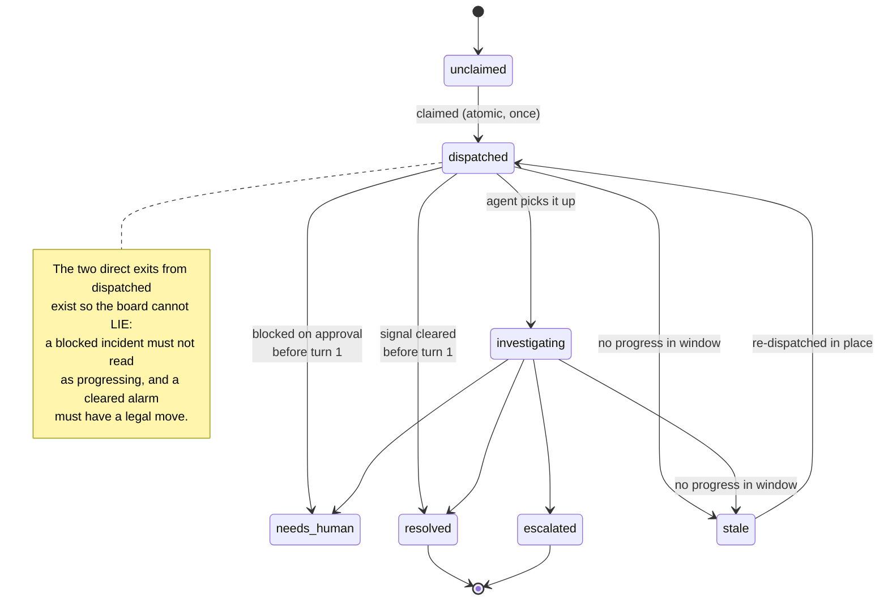
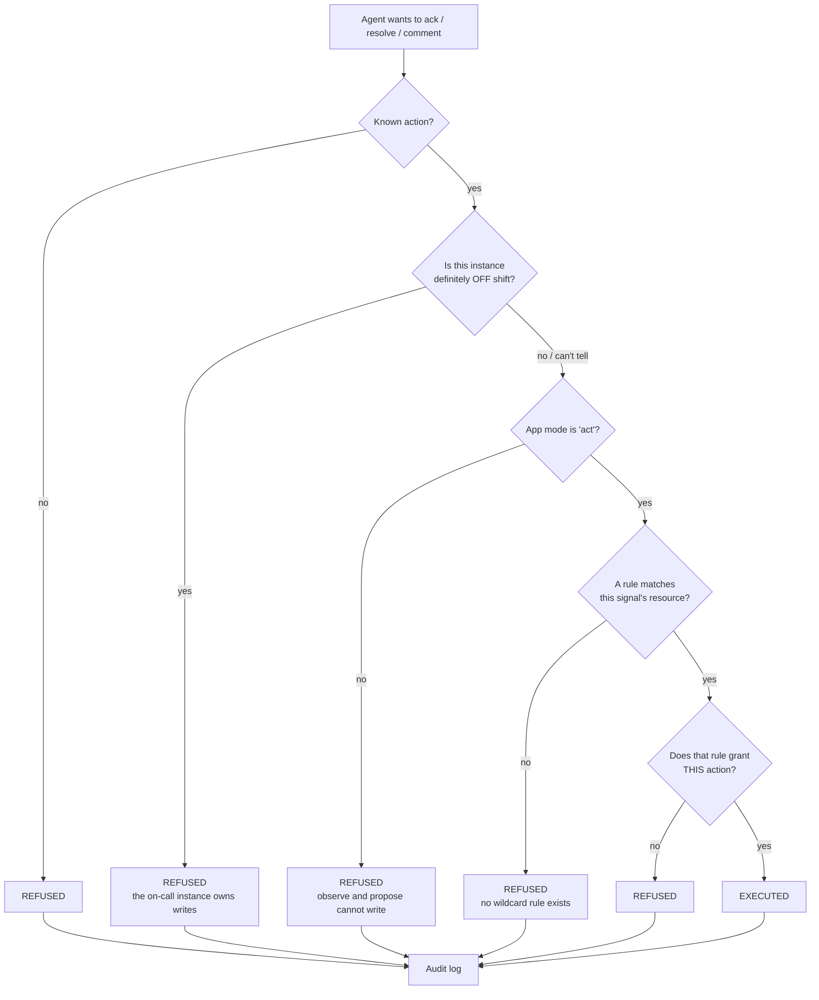
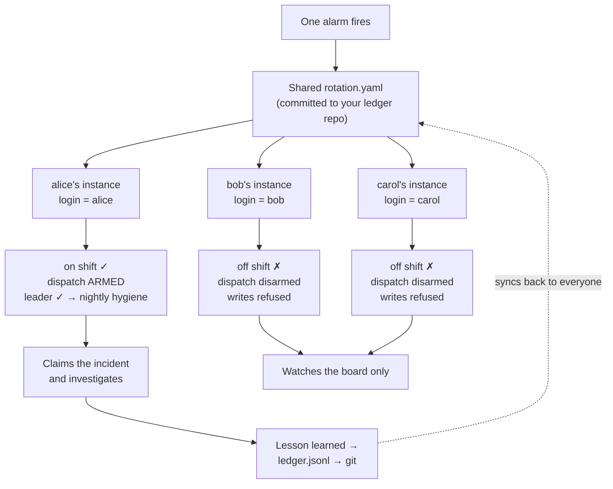

# Ops Mission Control — User Manual

**An autonomous ops first responder that runs on your own machine.**

It watches your alarms, pages, and monitors. When something fires, it claims the
signal, gathers the evidence a human would have gone looking for, and hands you a
real diagnosis instead of a raw alert. Everything it learns goes into a ledger, so
the second time a failure happens it starts from what you already know.

It is **read-only until you say otherwise**, it works for a **solo operator or a
whole on-call team**, and it needs no SaaS account of its own — your existing
CloudWatch, PagerDuty, Datadog, or GitHub is the source of truth.

---

## Table of contents

1. [What problem this solves](#1-what-problem-this-solves)
2. [How it works](#2-how-it-works)
3. [Quick start (10 minutes)](#3-quick-start-10-minutes)
4. [Connecting your systems](#4-connecting-your-systems)
5. [The board: reading an incident](#5-the-board-reading-an-incident)
6. [Autonomy: from watching to acting](#6-autonomy-from-watching-to-acting)
7. [The knowledge ledger](#7-the-knowledge-ledger)
8. [Working as a team](#8-working-as-a-team)
9. [Slack](#9-slack)
10. [Security model](#10-security-model)
11. [Reference](#11-reference)
12. [Troubleshooting](#12-troubleshooting)
13. [Limits and honest caveats](#13-limits-and-honest-caveats)

---

## 1. What problem this solves

At 3am an alarm fires. Someone gets paged, opens four consoles, runs the same six
queries they ran the last time this happened, finds the same cause, applies the
same fix, and goes back to bed. Nothing about that night makes the next one
shorter.

The expensive part is not the fix — it is the **cold start**: rebuilding context
that somebody already had, at the worst possible hour.

Ops Mission Control attacks the cold start directly:

| Without it | With it |
|---|---|
| Alert arrives as a name and a threshold | Incident arrives with alarm history, recent logs, and the affected resource |
| You remember (or don't) that this happened before | Matching past incidents and their fixes are attached to the page |
| Investigation starts when a human wakes up | Investigation has already run; you read a diagnosis |
| Knowledge lives in one person's head | Knowledge lives in a reviewable ledger your team shares |
| Every teammate's tooling duplicates the work | Exactly one on-call instance picks up each signal |

It does **not** try to be your monitoring system, your pager, or your runbook
engine. It sits between them and does the part none of them do: the investigating.

---

## 2. How it works



**The five-step loop.**

1. **Watch.** Every 2 minutes, enabled providers are polled for open work.
2. **Claim.** A firing signal becomes an *incident*. Claiming is an atomic
   compare-and-set, so one signal can never produce two investigations — the
   guarantee that makes a whole team's instances safe to run at once.
3. **Brief.** The gateway gathers evidence *for* the agent: alarm history, recent
   log lines, monitor context. This matters because **the agent has no cloud
   credentials of its own** — the gateway reads on its behalf and redacts before
   the text ever reaches a prompt.
4. **Investigate.** An agent works the incident against a shipped SOP and records
   a diagnosis, the actions it took, and next steps.
5. **Learn.** Confirmed `pattern → fix` pairs go into the ledger. Next time a
   matching signal fires, the fix arrives *with* the page.

---

## 3. Quick start (10 minutes)

You need KiroCrew running. Nothing else — no cloud account is required to see the
app work end to end.

### Step 1 — Enable the app

Dashboard → **Apps** → **Ops Mission Control** → toggle on. A **Mission Control**
entry appears in the nav.

Nothing runs yet. Until a provider is configured, every scheduled job checks that
and exits silently, by design — an app that has nothing to do should cost nothing.

### Step 2 — Send it a signal (no cloud account needed)

The **webhook** provider accepts signed JSON from anything. In
Settings → Providers → Webhook, generate a signing secret, then:

```bash
OMC="http://localhost:6777/api/apps/ops-mission-control"
SECRET="<the secret you just saved>"
BODY='{"id":"demo-1","title":"Checkout p99 latency breach","severity":"high","resource":"svc/checkout"}'
SIG=$(printf '%s' "$BODY" | openssl dgst -sha256 -hmac "$SECRET" -r | cut -d' ' -f1)

curl -X POST "$OMC/webhook?token=$KIROCREW_TOKEN" \
  -H 'Content-Type: application/json' \
  -H "X-OMC-Signature: $SIG" \
  -d "$BODY"
```

The signature is mandatory. An unsigned or wrongly-signed delivery is rejected with
`401` and **nothing is ingested** — otherwise anyone who could reach the port could
manufacture an incident and direct your agent's attention.

### Step 3 — Watch it work

Open **Mission Control**. Within a heartbeat the signal becomes an incident and
moves `unclaimed → dispatched → investigating`. Click it to see the evidence, the
diagnosis as it lands, and an embedded chat where you can ask follow-up questions
in the incident's own context.

### Step 4 — Teach it something

When the investigation finds the cause, record it:

> *"Remember: checkout p99 breaches are almost always the stuck SQS consumer —
> drain the queue and scale the ASG."*

Re-send the same signal. This time the fix is attached to the incident **before**
anyone looks at it. That is the compounding-memory payoff, and it only shows up on
the second occurrence.

---

## 4. Connecting your systems

Settings → **Providers**. Each provider is inert until it is *both* enabled **and**
holding its credentials — the UI shows `configured` so there is never any doubt.

| Provider | Gives you | You need |
|---|---|---|
| **AWS CloudWatch** | Alarms as signals; alarm history + log evidence | AWS credentials in the environment (a profile or role), plus a region |
| **PagerDuty** | Incidents as signals; on-call schedule; ack/resolve/note | A **REST API token** (`u+…`) and a `from_email` for writes |
| **Slack** | Board mirrored as replyable threads | Nothing here — reuses KiroCrew's own Slack ([§9](#9-slack)) |
| **Datadog** | Monitors in Alert/Warn as signals; metric evidence | An **API key** and an **application key**; site if not US |
| **GitHub Issues** | Labelled issues as signals | A repo, optional label filter, `gh` on PATH |
| **Webhook** | Anything that can POST signed JSON | A signing secret you generate |
| **Schedule file** | On-call rotation from a committed file | A `rotation.yaml` in your ledger repo |

**On AWS credentials.** Prefer a **read-only** profile. Nothing in the default
configuration writes to AWS — evidence gathering is `Describe`/`Get`/`Filter` calls
only. Give it the least privilege that lets it read the alarms and logs you care
about.

**On PagerDuty.** It needs a **REST API token**, not your login and password —
authentication is `Authorization: Token token=<api_token>`, and there is no
username/password path in the PagerDuty v2 API. Create one under *PagerDuty →
Integrations → API Access Keys*.

Choose the scope deliberately, because the token you paste is the ceiling on what
can ever happen:

| Token | Gives you | Use when |
|---|---|---|
| **Read-only** | Incidents as signals, on-call schedule | You want triage and rotation only — **start here** |
| **Read-write** | The above, plus `ack` / `resolve` / `comment` | You intend to eventually grant `act` |

A read-write token does **not** by itself let the agent write: the autonomy gate
still refuses unless the app is in `act` mode *and* a scoped rule matches. Storing a
write-capable token while in `observe` is safe and verified — but prefer read-only
until you actually want writes, and rotate the token on your normal schedule.

To enable PagerDuty writes you also need three things beyond the token: a
**service** the app polls (`service_ids`), a **schedule** if you want rotation
(`schedule_ids`), and a `from_email` PagerDuty will attribute the action to. To
grant authority, set `mode: "act"` and add a rule. Both go through the authenticated
dashboard — `PUT /api/apps/ops-mission-control/settings` — which writes them to the
keystone policy file (`~/.kiro/crew/ops_mission_control_policy.json`), NOT to the app's
`data/config.json`. That distinction is the whole point: `config.json` is readable and
writable by the agent, so a ceiling stored there would be one the constrained party could
raise. The keystone file is fenced from the agent entirely.

```json
{
  "mode": "act",
  "autonomy_rules": [
    {
      "source": "pagerduty",
      "resource_glob": "Checkout*",
      "mode": "act",
      "actions": ["ack"]
    }
  ]
}
```

`resource_glob` (or `label_match`) is required — there is no wildcard — and `actions`
narrows further, so the rule above permits `ack` and still refuses `resolve` on the same
incident. A rule that fails validation is **refused with a 400**, not saved and quietly
ignored: a grant that looks stored but never matches is worse than no grant at all.

Read the current grants back from `GET /api/apps/ops-mission-control/rotation` →
`rules_detail`, which returns the PARSED rules in the same shape the PUT accepts.

**On Datadog.** Only monitors in `Alert` or `Warn` become signals. `No Data` is
deliberately excluded: on any account with idle resources it is high-volume and
low-signal. If you connect Datadog and see no incidents, check your monitors'
states before assuming something is broken.

**Credentials are write-only over the API.** You can set a secret and see *whether*
a field is set; you can never read one back. See [§10](#10-security-model).

---

## 5. The board: reading an incident

An incident moves through a small, strict state machine:



Illegal moves are refused rather than silently applied, so the board cannot drift
away from reality. Two edges are worth understanding, because they exist to stop
the board **lying to you**:

- **`dispatched → needs_human`** — an agent can block on a tool approval before it
  finishes its first turn. Without this edge a blocked incident would read as
  *progressing*, which is the one thing an ops board must never do.
- **`dispatched → resolved`** — a flapping alarm can clear in the gap between being
  claimed and the first turn. Without this edge, reconciliation has no legal move
  and the board keeps claiming work is underway on a problem that no longer exists.

**A recurrence is a new incident, not a reopening.** When an alarm you already
resolved fires again, you get a fresh incident with its own timeline, linked to the
same ledger knowledge. Your history stays honest, and the fast path can actually
pay off.

Each incident shows the originating signal, the gathered evidence, matched ledger
lessons with their trust level, the diagnosis, proposed actions, and next steps —
plus a companion chat scoped to that incident.

---

## 6. Autonomy: from watching to acting

The app ships in **`observe`** mode. It will read, investigate, and tell you things;
it will not change anything anywhere.

| Mode | The agent may |
|---|---|
| `observe` | Read, investigate, post findings. Change nothing. **Default.** |
| `propose` | All of the above, plus draft an ack/resolve/comment and ask you. |
| `act` | Execute an approved action — **only** where a rule allows it. |

Raising the mode is **not** sufficient on its own. Every write attempt runs this
gauntlet, and **any** refusal stops it:



In short: `effective authority = min(app mode, matching rule mode)`.

To let it acknowledge a page you must (a) set the app to `act` **and** (b) write a
rule scoped to a resource pattern. There is deliberately **no wildcard** — a rule
without a `resource_glob` is rejected at load, so "act on everything" is not a
setting you can reach by accident.

A rule can narrow further: grant `ack` only, and a `resolve` attempt on the same
signal is still refused.

**Every decision — allow *and* deny — is written to the security audit log.** If
you ever want to know why the agent did or did not touch something, the answer is
recorded.

Two more refusals apply no matter how permissive your rules are:

- **Off-shift instances cannot write.** If the rotation positively says a teammate
  owns the shift, your instance will not acknowledge or resolve anything, even in
  `act` mode with a matching rule. (It refuses only on a *definite* off-shift
  answer — a solo operator with no rotation is never blocked.)
- **Unknown actions are refused.** Only `ack`, `resolve`, and `comment` exist.

**Recommended path:** run in `observe` for a week. Read what it would have done.
Move to `propose`. Only then grant `act`, one narrow rule at a time.

---

## 7. The knowledge ledger

The ledger is an append-only file of `pattern → fix` lessons, each carrying a
**confidence** level and a **trust** level (was this verified by a human, or merely
inferred?).

When a signal arrives, the ledger is consulted two ways: an exact **fingerprint**
match, and a **semantic** similarity search for things that are alike but not
identical. Matches ride along with the incident.

A lesson that is both high-confidence and human-verified enables the **fast path**:
the agent leads with the known fix instead of re-deriving it.

Maintenance runs nightly, unattended:

- **Decay** — a lesson unused for 90 days is downgraded rather than trusted forever.
- **Cap** — the ledger is bounded (500 entries), trimming least-valuable first.
- **Contradiction detection** — two different fixes for the same fingerprint are
  surfaced for you to adjudicate, most-used first. Ops knowledge goes stale, and
  the honest response is to show you the conflict rather than silently pick one.

**Lesson ids are content-addressed** — derived from the pattern and fix themselves.
This is what makes team sync work: if you and a teammate independently learn the
same thing, you converge on one entry instead of accumulating duplicates.

---

## 8. Working as a team

The problem with N engineers each running an ops agent is obvious: an alarm fires
and all N pile onto it, duplicating work and racing each other's writes.

The answer here is **one shared file, committed to a git repo your team already
has**:

```yaml
# rotation.yaml — at the root of your ledger repo
leader: alice                    # optional; runs nightly ledger maintenance ALONE
timezone: America/Los_Angeles    # optional; UTC when absent
shifts:
  - from: 2026-08-01
    to:   2026-08-08
    who:  alice                  # a GitHub login
  - from: 2026-08-08T09:00
    to:   2026-08-15T09:00
    who:  [bob, carol]           # co-primary is allowed
```

Identity is your **GitHub login**, resolved locally. Every instance reads the same
file and reaches the same conclusion about who owns right now — so of three
teammates whose agents all see the same alarm, exactly one acts on it:



**Why a file and not a rotation service?** It is already synced (it lives in the
repo your team shares), it is reviewable (a shift swap is a diff with an author and
a timestamp — a better audit trail than most rotation UIs), and it **fails closed**.

That last property is the important one and it is the *opposite* of what a rotation
API should do:

| Source | Cannot determine your shift | Why |
|---|---|---|
| Rotation **API** (PagerDuty) | Assumes **on** shift | A network blip must never switch off a team's incident response |
| Committed **file** | Assumes **off** shift | If the file cannot say you own the shift, assuming you do is exactly how all N teammates claim the same alarm |

Three tiers of automation arm and disarm themselves accordingly:

| Tier | Jobs | Runs when |
|---|---|---|
| `always` | rotation check | always — otherwise an off-shift instance could never re-arm |
| `on_shift` | dispatch, reconcile | you are on shift |
| `primary` | nightly ledger maintenance | you are the `leader` |

The `leader` key exists because "primary" was previously a *local* setting that
defaulted to on — so on a team where nobody opted out, every instance ran
maintenance against one shared ledger. Concurrent pruning is worse than concurrent
claiming: a duplicate claim wastes a turn, a duplicate prune deletes knowledge.

The board shows your full team composition and badges whoever is on call, so
"who has this?" is answered before anyone asks.

**Sharing memory — where to set the repo.** In **Settings → Ops Mission Control**,
set the shared-ledger remote (any git URL your team can push to, SSH or HTTPS), the
branch, and turn sync on. Over the API that is:

```bash
curl -X PUT "$OMC/settings?token=$TOKEN" -H 'Content-Type: application/json' -d '{
  "ledger_sync_remote": "git@github.com:acme/ops-ledger.git",
  "ledger_sync_branch": "main",
  "ledger_sync_enabled": true
}'
```

There is **no credential to enter** — sync uses your own git/SSH/`gh` auth, the same
as running `git push` by hand. `GET /state` reports the sync status (`remote`,
`branch`, `initialized`, `ready`) plus a `detail` line naming the next step when it
is not ready.

The repo is created on the first sync; the nightly maintenance job then pulls,
reconciles, and pushes. Every teammate points at the same remote and the ledgers
converge. Point it at the **same repo that holds your `rotation.yaml`** — one repo
carries both the team's memory and its on-call schedule.

Only three files are ever touched: `ledger.jsonl`, `rotation.yaml`, `.gitignore`.
Conflicts in the ledger resolve as a **union** (nobody's lesson is lost). A conflict
in `rotation.yaml` **blocks the push** instead of guessing — a mis-merged rotation
silently reassigns who is on call, and refusing is the safe failure.

---

## 9. Slack

**This app adds no Slack integration of its own.** It reuses the Slack connection
KiroCrew already has: the live client is read off gateway state at request time.
There is no second bot token, no separate app to install in your workspace, and no
Slack credential in this app's settings. If KiroCrew's Slack works, this works; if
you have not set Slack up, the app reports `slack_available: false` and simply skips
the mirror.

To turn it on: configure Slack in KiroCrew's own settings, then set a channel in
Settings → Ops Mission Control. The `state` endpoint reports `ready` only when the
app is enabled, a channel is set, **and** the core client exists — so a
misconfiguration is visible rather than silent.

Once connected, the board becomes a channel. Incidents post as threads, and each
thread is **replyable** — answer in Slack and you are talking to the agent working
that incident. Status changes edit the message in place rather than spamming the
channel, and finished work is unpinned. Incident text is redacted on this path just
like every other egress.

For many teams this is the primary interface: the channel *is* the dashboard.

---

## 10. Security model

This app holds credentials to your production incident tooling and drives an agent
that reads your logs. The design assumes that is dangerous.

**Credentials the agent cannot reach.** Provider tokens live in a keystone file
that is on KiroCrew's sensitive-path floor — the agent can neither **read** nor
**write** it, including via `cp`, `mv`, `tar`, or a shell redirect. The
authenticated dashboard is the only writer.

Why not ordinary app config? Two concrete reasons: an app's `config.json` is served
over an endpoint *without* session auth, and it is writable by any auto-approved
agent shell. The keystone is the only placement where neither hole applies.

**Credentials that cannot ride out.** All provider payloads pass through a single
redaction chokepoint before they reach a model prompt, a transcript, Slack, or the
UI. It is centralised on purpose: an adapter author who forgets to redact *cannot*
cause a leak, because they are not the one doing it. Redaction is an always-on
floor with **no** setting to disable it.

**The agent has no cloud credentials.** It cannot call AWS or Datadog itself. The
gateway reads on its behalf and redacts first. Investigation briefs state this
explicitly, so the agent does not waste turns trying.

**Bounded by construction.** Signed webhooks only. Size-capped payloads. Sandboxed
subprocesses with resource limits. Every autonomy decision — allow and deny —
audited. Read-only by default, with no wildcard path to `act`.

---

## 11. Reference

### Autonomy modes

| Mode | Reads | Proposes | Executes |
|---|---|---|---|
| `observe` (default) | yes | no | no |
| `propose` | yes | yes | no |
| `act` | yes | yes | only where a scoped rule allows |

### Incident statuses

`unclaimed` · `dispatched` · `investigating` · `needs_human` · `resolved` ·
`escalated` · `stale`

### Actions

`ack` · `resolve` · `comment`

### Scheduled jobs

| Job | Cadence | Tier |
|---|---|---|
| dispatch | 2 min | `on_shift` |
| reconcile | 15 min | `on_shift` |
| rotation check | 5 min | `always` |
| ledger maintenance | nightly | `primary` |

### Key paths

| What | Where |
|---|---|
| Incidents + ledger | `<data home>/apps/ops-mission-control/data/` |
| Provider secrets | `<data home>/ops_mission_control_secrets.json` (keystone) |
| Rotation schedule | `rotation.yaml` at your ledger repo root |
| SOPs the agent follows | `<data home>/skills/ops-mission-control/sops/` |

---

## 12. Troubleshooting

**Nothing appears on the board.**
Check Settings → Providers: at least one must show `configured: true`. Until then
every job exits silently by design. For Datadog specifically, confirm a monitor is
actually in `Alert`/`Warn` — `No Data` never becomes a signal.

**A webhook returns 401.**
The signature must be HMAC-SHA256 over the **raw** body, keyed by the signing
secret, in the `X-OMC-Signature` header as a bare hex digest (no `sha256=` prefix).
Re-serialising the JSON before signing changes the bytes and breaks the signature.

**Dispatch never runs.**
It is on the `on_shift` tier and ships paused. Rotation check arms it. If your
`rotation.yaml` cannot resolve your GitHub login, the file *fails closed* and
dispatch stays disarmed — that is intentional. Check `who` and `unknown` on the
rotation panel. A solo operator with no `rotation.yaml` at all is always armed.

**The agent refuses to acknowledge a page.**
Expected unless all of these hold: app mode is `act`, a rule matches the signal's
resource, the rule grants that specific action, and your instance is not off shift.
The audit log records which condition failed.

**A teammate and I both picked up the same alarm.**
Both instances think they are on shift. Confirm you are reading the same committed
`rotation.yaml`, that your logins resolve, and that the current time falls in
exactly one window.

**Two lessons contradict each other.**
That is the contradiction detector working. Review the pair and delete the stale
one.

---

## 13. Limits and honest caveats

- **PagerDuty `ack` and `resolve` are verified against a live tenant** — triggered a
  real incident, acknowledged it, resolved it, and confirmed each write by reading
  the incident back independently. **`comment` is not yet verified live** (it posts
  to a different endpoint, `/incidents/{id}/notes`).
- **Datadog is read/evidence only.** No write actions.
- **No long-run soak yet.** The app has not run unattended for days. Run it in
  `observe` for a while before trusting `act`.
- **It is an assistant, not an SRE.** It is very good at the cold start and
  genuinely useful on repeat failures. A novel, ambiguous, multi-system outage
  still needs you — which is why `needs_human` is a first-class status and the
  default mode changes nothing.
- **Windows** is supported for the backend, but desktop-specific paths are
  POSIX-first; verify on your platform.

---

*Ops Mission Control is part of KiroCrew and runs entirely on your machine. An
optional companion package adds Amazon-internal integrations and is distributed
separately.*
